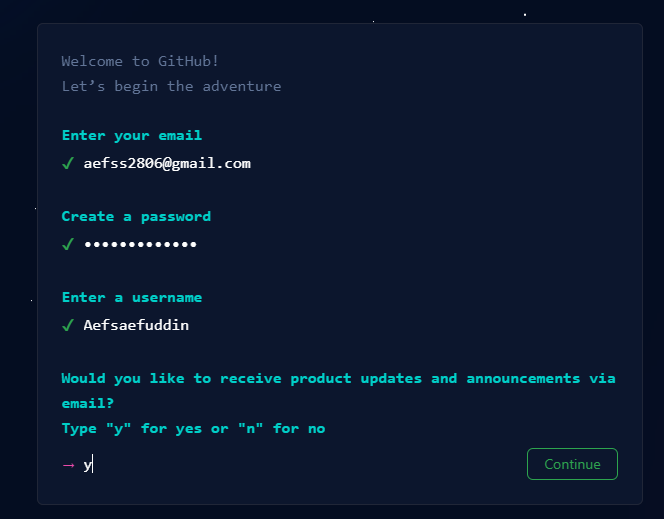
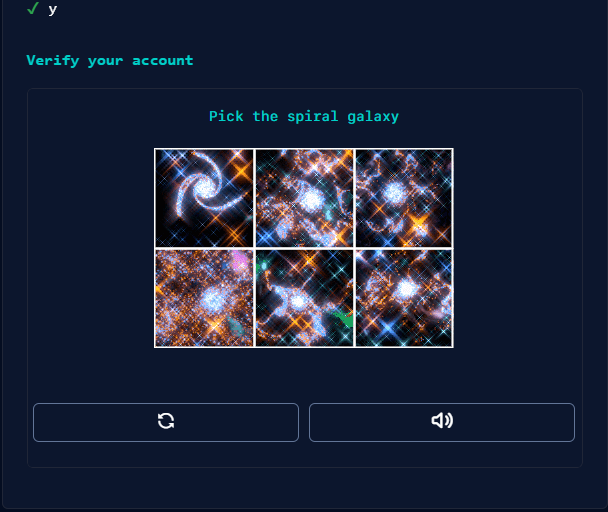

# aefss
## Tutorial Buat Akun Git

### Menuju Github
ini adalah tampilan pertama pada menu Github

Maka Klik Sign Up, maka tampilan akan berubah lalu masukan email yang mau kalian daftarkan

Buatlah daftar diri kalian sesuai yang kalian inginkan

Lalu akan muncul verify `"pick spiral galaxy"`

Kemduian Masuk Tampilan Untuk Membuat New Repository
![img]screenshot/ss.5.png
Lalu Buat Name Repository Yang Anda Inginkan Lalu Klik Publik kemudian Klik Readme file lalu Create Repository
![img]screenshot/ss6.png