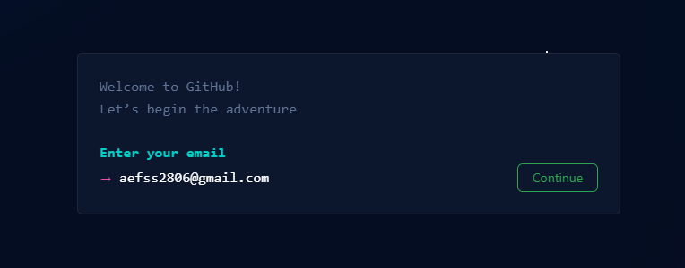
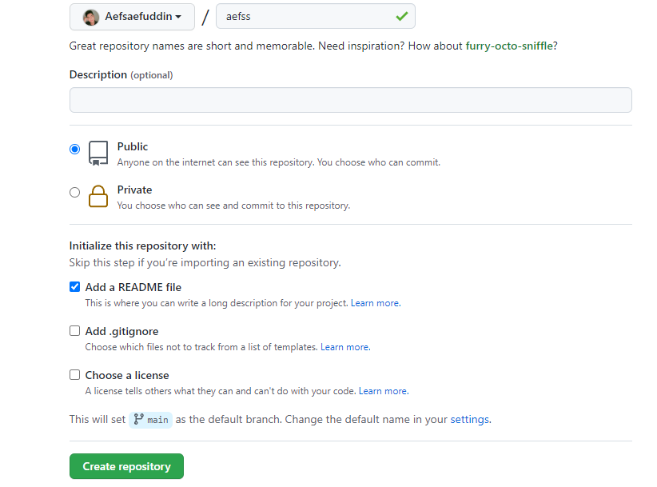

# aefss
## Tutorial Buat Akun Git

### Menuju Github
    ini adalah tampilan pertama pada menu Github

    Maka Klik Sign Up, maka tampilan akan berubah lalu masukan email yang mau kalian daftarkan

    Buatlah daftar diri kalian sesuai yang kalian inginkan

    Lalu akan muncul verify `"pick spiral galaxy"`

    Kemudian Masuk Tampilan Untuk Membuat New Repository

    Lalu Buat Name Repository Yang Anda Inginkan Lalu Klik Publik kemudian Klik Readme file lalu Create Repository
